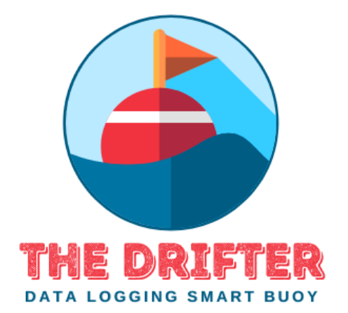

# The Drifter
The Drifter is a low cost self maintained water quality smart buoy. It takes a multitude of data 
points such as water temperature, pH, and conductivity. Power is drawn from an internal battery along
with a solar panel to recharge the battery. The said data is stored on a local SD Card and also 
sent to a base station through LoRa radio signals.

## Table of contents
* [General Info](#general-info)
* [Drifter Team Logo](#Drifter-Team-Logo)
* [Technologies](#technologies)
* [Setup](#setup)
* [Features](#features)
* [Status](#status)
* [Contact](#contact)

## General info

Add more general information about project. What the purpose of the project is? Motivation?

## Drifter Team Logo


## Technologies
* Arduino IDE version 1.8.19

## Setup
* Download the latest Drifter Arduino ino file to a easy to access location.
* Open the microsoft store or equivalent and download the Arduino IDE program.
* Download all the required libraries listed in the beginning of the Code Examples section.
* Run the code to verify all the necessary libraries have been downloaded.
* The code is now ready to be uploaded to the ESP32 Firebeetle.

## Code Examples
All Used Libraries: 

* #include "Adafruit_EPD.h"
* #include "math.h"
* #include "Adafruit_INA219.h"
* #include "RTClib.h"
* #include <DHT.h>
* #include <SD.h>
* #include <SPI.h>
* #include <LoRa.h>
* #include <ESP32Time.h>
* #include <Wire.h>
* #include <Adafruit_LIS3DH.h>
* #include <Adafruit_Sensor.h>
* #include <OneWire.h>
* #include <DallasTemperature.h>
* #include <BLEDevice.h>
* #include <BLEServer.h>
* #include <BLEUtils.h>
* #include <BLE2902.h>

ESP32 Sleep Code Example:
```
void BeginSleep() {
  TimeAwake = (millis() - StartTime);
  long SleepTimer = (((SleepDuration * 60 ) * 1000000LL)- TimeAwake);
  int TimeAwakeSec = ((TimeAwake / 1000), 0);
 
  esp_sleep_enable_timer_wakeup(SleepTimer);  
  
  Serial.println("\n\nEntering " + String(SleepDuration) + " minutes of sleep time");
  if(TimeAwake < 60000){
    Serial.println("Awake for : " + String(TimeAwake / 1000.0) + " seconds");}
  else{
    Serial.println("Awake for : " + String(TimeAwake / 60000.0) + " minutes");}
  
  Serial.println("\nGoing to sleep...");
  esp_deep_sleep_start();  // Sleep for e.g. 30 minutes
}
```

## Features
List of features ready and TODOs for future development
* Bluetooth Communication
* LoRa Communication
* Internal Storage Via Micro SD Card
* Solar Panel With Charging Capabilities for Maker Focus 3.7 Volt Lipo Battery

To-do list:
* None

## Status
Project is:  ***Finished***

## Contacts
Artests@gmail.com, jacobhuntersmith@icloud.com, jbm7630@gmail.com, Rodolfomontero123@gmail.com
